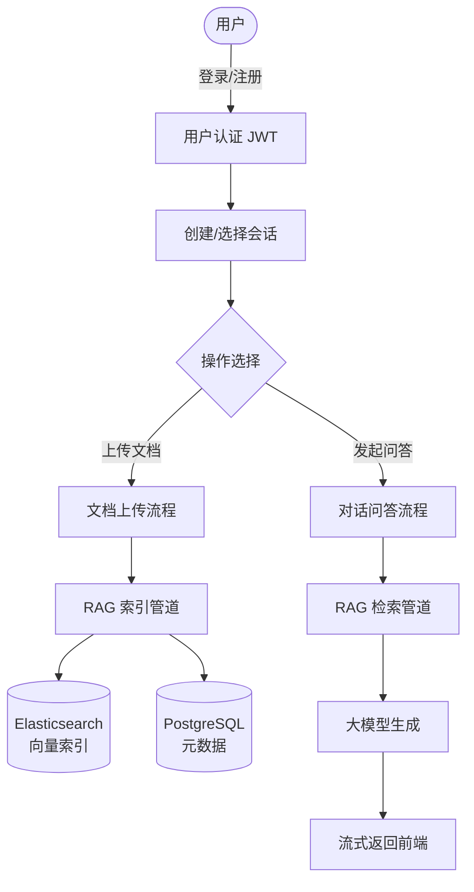
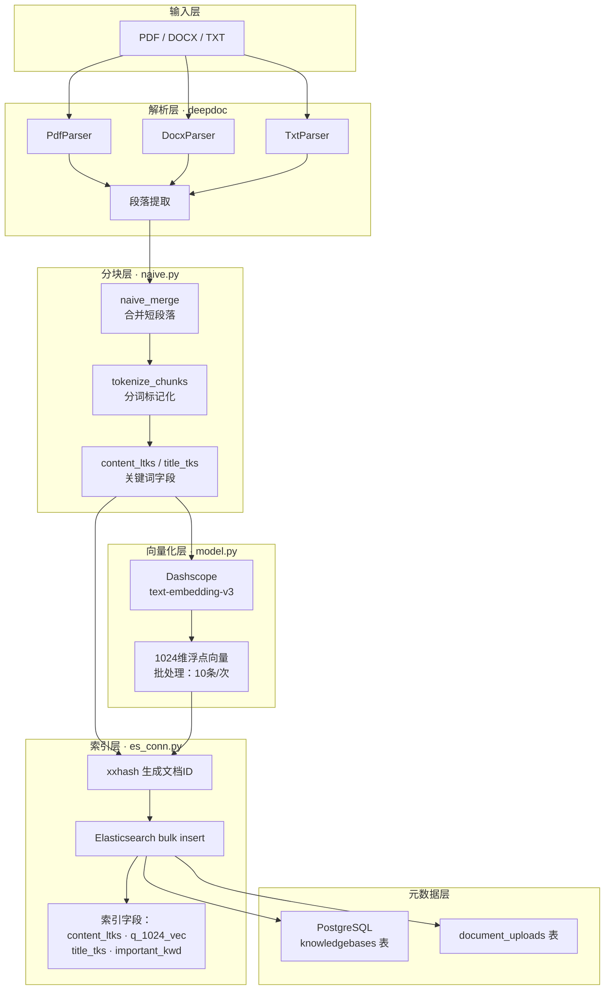
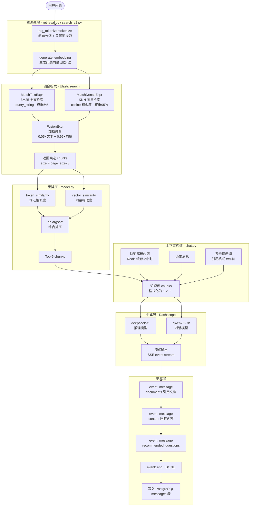
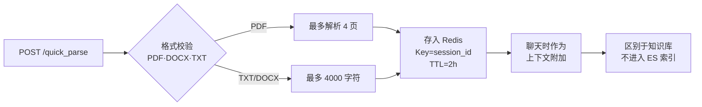
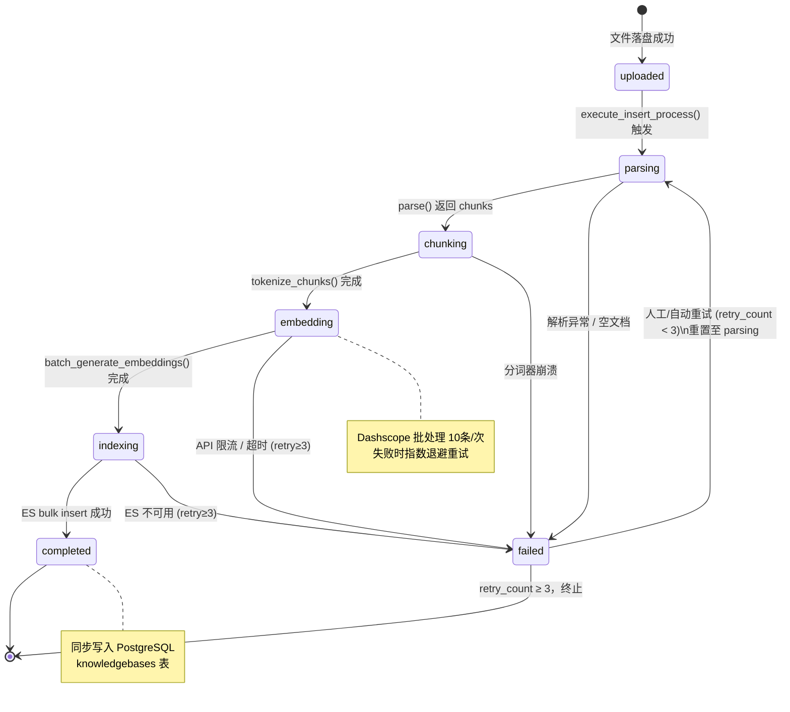
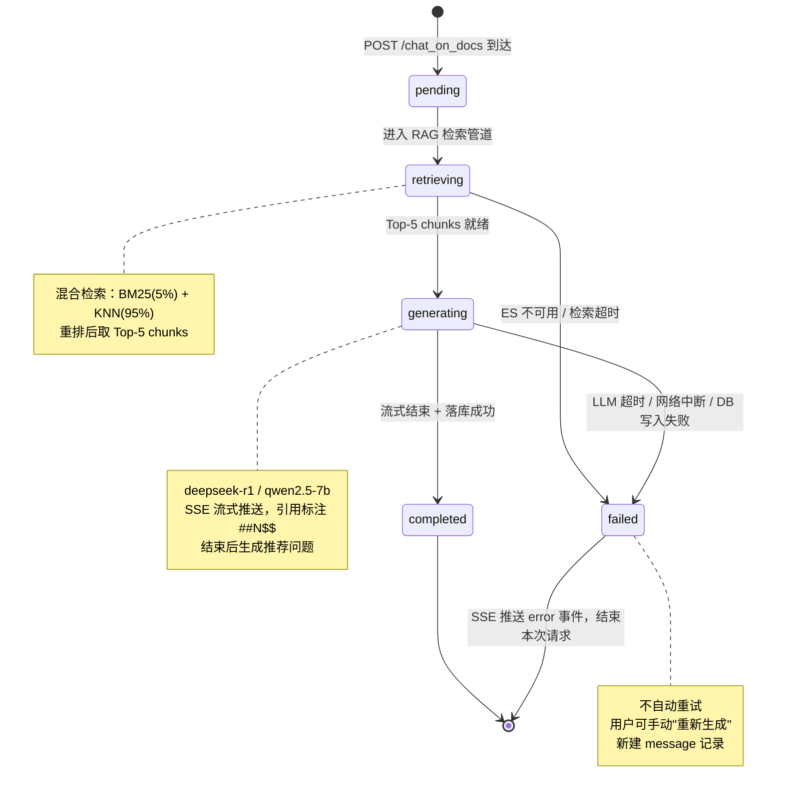
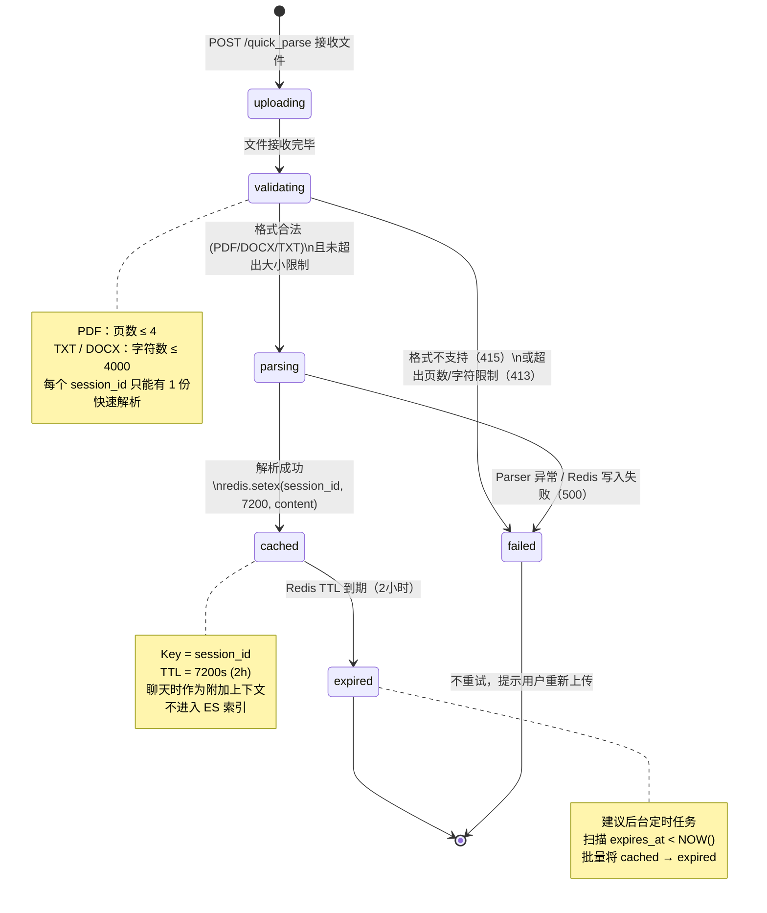

# 产品设计逻辑

> 基于 RAG（检索增强生成）的企业级知识库问答系统

---

## 一、整体产品流程



---

## 二、RAG 核心流程 — 文档入库



---

## 三、RAG 核心流程 — 问答检索与生成



---

## 四、快速解析流程（Session 级临时文档）



---

## 五、关键参数一览

| 环节 | 参数/配置 |
| ------ | --------- |
| 文档向量维度 | 1024 维（text-embedding-v3） |
| 嵌入批处理大小 | 10 条/请求（Dashscope 限制） |
| 文本 vs 向量权重 | 5% : 95% |
| 检索候选数 | `page_size × 3`（重排前） |
| 最终返回 Top | 5 个 chunks |
| 重排范围 | 前 3 页启用模型重排 |
| 快速解析限制 | PDF ≤ 4 页 / TXT·DOCX ≤ 4000 字符 |
| 快速解析缓存 | Redis，2 小时 TTL |
| 引用标注格式 | `##序号$$`（前端渲染为角标） |

---

## 六、核心文件索引

| 功能 | 文件路径 |
| ------ | --------- |
| 路由入口 | `backend/app/router/chat_rt.py` |
| 聊天编排 | `backend/app/service/core/chat.py` |
| 检索调度 | `backend/app/service/core/retrieval.py` |
| 混合搜索 | `backend/app/service/core/rag/nlp/search_v2.py` |
| 文档分块 | `backend/app/service/core/rag/app/naive.py` |
| 向量生成 | `backend/app/service/core/rag/nlp/model.py` |
| ES 操作 | `backend/app/service/core/rag/utils/es_conn.py` |
| 快速解析 | `backend/app/service/quick_parse_service.py` |

---

## 七、数据存储分布

| 数据类型 | 存储位置 | 说明 |
| -------- | -------- | ---- |
| 文档 chunks + 向量 | Elasticsearch | 索引名为 `{user_id}` |
| 用户、会话、消息 | PostgreSQL | 关系型元数据 |
| 快速解析内容 | Redis | TTL 2 小时，Key 为 session_id |
| 上传文件 | 本地文件系统 | `storage/file/{session_id}/{filename}` |

---

## 八、状态机设计

### 8.1 文档上传与入库状态流转

> 对应表：`document_uploads` · `knowledgebases`

#### 状态说明

| 状态 | 含义 | 可重试 |
| --- | --- | --- |
| `uploaded` | 文件已落盘，等待触发处理管道 | — |
| `parsing` | 正在调用 deepdoc 解析文档内容 | 是 |
| `chunking` | 正在执行 naive_merge + tokenize | 是 |
| `embedding` | 正在调用 Dashscope 批量生成向量 | 是 |
| `indexing` | 正在向 Elasticsearch bulk insert | 是 |
| `completed` | 全流程成功，知识库可用 | — |
| `failed` | 任意步骤异常，流程终止 | 是（限3次） |

#### 状态转换条件与失败处理

| 转换 | 触发条件 | 失败原因 | 失败动作 |
| --- | --- | --- | --- |
| `uploaded` → `parsing` | 调用 `execute_insert_process()` | 文件损坏 / 格式不支持 | 写 `failed` + `error_message` |
| `parsing` → `chunking` | `parse()` 返回非空 chunks | Parser 抛出异常 / 空文档 | 同上，retry_count +1 |
| `chunking` → `embedding` | `tokenize_chunks()` 正常结束 | 分词器崩溃 | 同上 |
| `embedding` → `indexing` | 所有批次 embedding 请求成功 | Dashscope 限流 / 网络超时 | 同上，指数退避重试 |
| `indexing` → `completed` | ES bulk 无错误响应 | ES 不可用 / 索引冲突 | 同上 |
| 任意 → `failed` | `retry_count >= 3` | 超过重试上限 | 停止，通知用户 |

#### Mermaid 状态图



#### 数据库字段建议（`document_uploads` 表新增）

```sql
status          VARCHAR(20)  NOT NULL DEFAULT 'uploaded',
  -- 枚举：uploaded / parsing / chunking / embedding / indexing / completed / failed

retry_count     SMALLINT     NOT NULL DEFAULT 0,
  -- 当前重试次数，上限 3

error_message   TEXT,
  -- 最后一次失败的异常信息

chunk_count     INTEGER,
  -- 文档被切分的 chunk 总数

indexed_count   INTEGER,
  -- 成功写入 ES 的 chunk 数

started_at      TIMESTAMP,
  -- 处理管道开始时间

completed_at    TIMESTAMP
  -- 状态变为 completed / failed 的时间
```

---

### 8.2 聊天消息状态流转

> 对应表：`messages`

#### 状态说明

| 状态 | 含义 | 可重试 |
| -------------- | ------------------------------------ | ------ |
| `pending`      | 用户问题已提交，等待处理             | —      |
| `retrieving`   | 正在检索知识库（ES 混合查询 + 重排） | 是     |
| `generating`   | LLM 流式生成中                       | 是     |
| `completed`    | 回答完整生成并落库                   | —      |
| `failed`       | 任意步骤异常，流终止                 | 是     |

#### 状态转换条件与失败处理

| 转换 | 触发条件 | 失败原因 | 失败动作 |
| ------------------------------ | ---------------------------------- | -------------------------------- | ----------------------------- |
| `pending` → `retrieving`       | 接收到 POST /chat_on_docs 请求     | —                                | —                             |
| `retrieving` → `generating`    | `retrieve_content()` 返回 chunks   | ES 不可用 / 查询超时             | 写 `failed` + `error_message` |
| `generating` → `completed`     | 流式结束 + `write_chat_to_db()` 成功 | LLM 超时 / 网络断开 / DB 写入失败 | 同上                          |
| 任意 → `failed`                | 捕获未处理异常                     | 上游服务异常                     | SSE 推送 error 事件，前端提示 |
| `failed` → `pending`           | 用户点击"重新生成"                 | —                                | 创建新 message 记录           |

#### Mermaid 状态图



#### 数据库字段建议（`messages` 表新增）

```sql
status              VARCHAR(20)  NOT NULL DEFAULT 'pending',
  -- 枚举：pending / retrieving / generating / completed / failed

error_message       TEXT,
  -- 失败时的异常信息

retrieval_time_ms   INTEGER,
  -- 检索阶段耗时（毫秒）

generation_time_ms  INTEGER,
  -- 生成阶段耗时（毫秒）

documents           JSONB,
  -- 检索到的引用文档列表 [{doc_id, doc_name, similarity, content}]

recommended_questions  JSONB,
  -- 推荐问题列表 ["问题1", "问题2", "问题3"]

think               TEXT,
  -- deepseek-r1 推理过程（thinking token）

started_at          TIMESTAMP,
completed_at        TIMESTAMP
```

---

### 8.3 快速解析文档状态流转

> 对应表：`document_uploads`（新增 `parse_type = 'quick'` 区分）  
> 缓存：Redis Key = `session_id`，TTL = 7200s

#### 状态说明

| 状态 | 含义 | 可重试 |
| ------------ | ------------------------------------ | ------ |
| `uploading`  | 文件正在通过 HTTP 上传中             | —      |
| `validating` | 校验文件格式与大小限制               | —      |
| `parsing`    | 按格式调用对应 Parser 提取文本       | 是     |
| `cached`     | 内容已写入 Redis，聊天可引用         | —      |
| `expired`    | Redis TTL 到期，缓存已失效           | —      |
| `failed`     | 格式不支持 / 超出限制 / 解析异常     | 否     |

#### 状态转换条件与失败处理

| 转换 | 触发条件 | 失败原因 | 失败动作 |
| -------------------------- | --------------------------------- | ---------------------------------- | ------------------------------ |
| `uploading` → `validating` | FastAPI 接收到完整文件            | 上传中断                           | 丢弃，返回 400                  |
| `validating` → `parsing`   | 格式为 PDF/DOCX/TXT               | 不支持的格式                       | 写 `failed`，返回 415           |
| `validating` → `failed`    | PDF > 4页 / TXT·DOCX > 4000字符   | 超出限制                           | 写 `failed`，返回 413           |
| `parsing` → `cached`       | 解析成功，`redis.setex()` 写入    | Parser 崩溃 / Redis 不可用         | 写 `failed`，返回 500           |
| `cached` → `expired`       | Redis TTL 自动到期（2小时后）     | —                                  | 更新 DB status = `expired`      |
| `failed` → [终止]          | 不重试，提示用户重新上传          | —                                  | —                               |

#### Mermaid 状态图



#### 数据库字段建议（`document_uploads` 表新增）

```sql
parse_type      VARCHAR(10)  NOT NULL DEFAULT 'full',
  -- 'quick'（快速解析）或 'full'（知识库入库）

status          VARCHAR(20)  NOT NULL DEFAULT 'uploading',
  -- 枚举：uploading / validating / parsing / cached / expired / failed

content_length  INTEGER,
  -- 解析得到的文本字符数

expires_at      TIMESTAMP,
  -- 快速解析缓存的预期过期时间（upload_time + 2h）

error_message   TEXT,
  -- 失败原因（格式不支持 / 超限 / 解析异常）

error_code      SMALLINT
  -- HTTP 语义错误码：413 / 415 / 500
```

---

### 8.4 三类状态机对比总览

| 维度 | 文档入库 | 聊天消息 | 快速解析 |
| ------------ | ------------------------- | ---------------------- | ----------------------- |
| 状态数       | 7                         | 5                      | 6                       |
| 终态         | completed / failed        | completed / failed     | expired / failed        |
| 是否可重试   | 是（最多3次）             | 否（用户手动重新生成） | 否（重新上传）          |
| 持久化存储   | PostgreSQL + ES           | PostgreSQL             | Redis（TTL）+ PostgreSQL |
| 失败通知     | 写 error_message          | SSE error 事件         | HTTP 错误码             |
| 状态字段位置 | document_uploads.status   | messages.status        | document_uploads.status（parse_type='quick'）|
